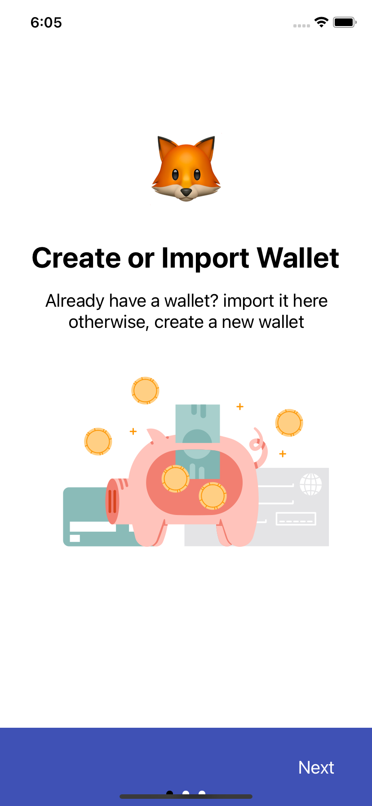
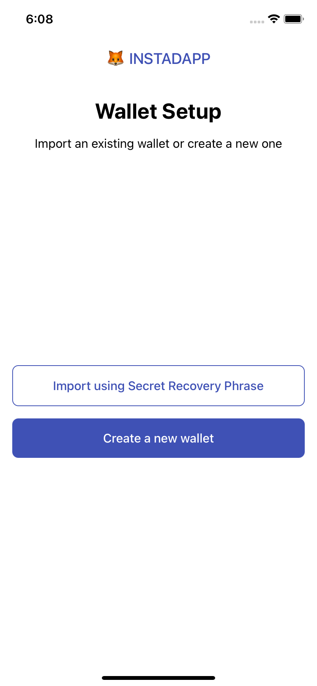
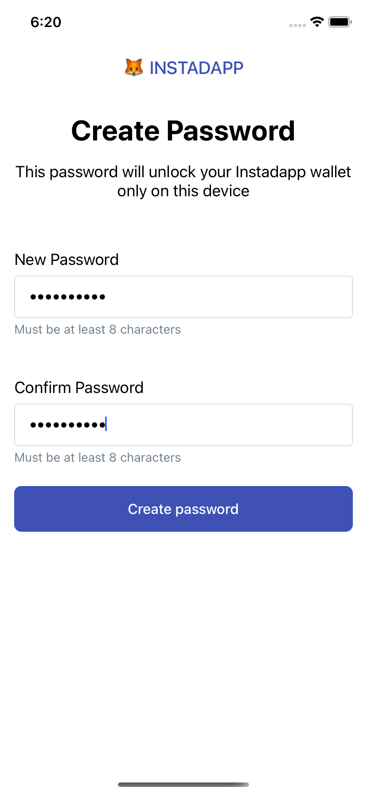
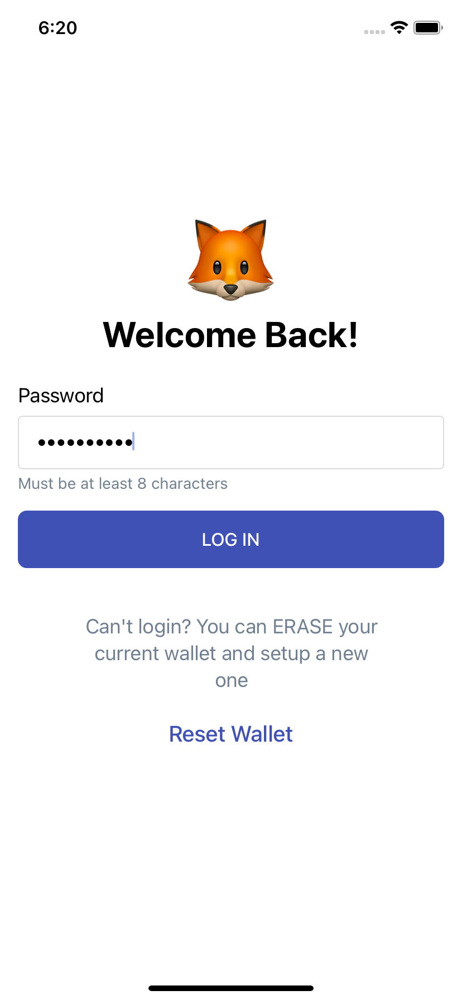
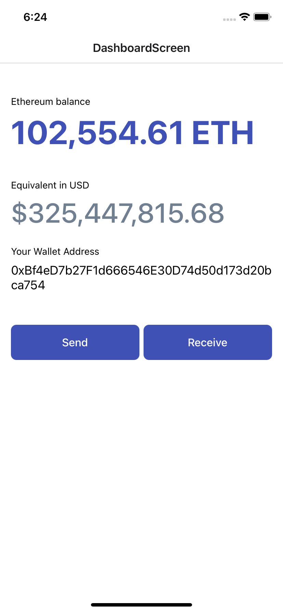
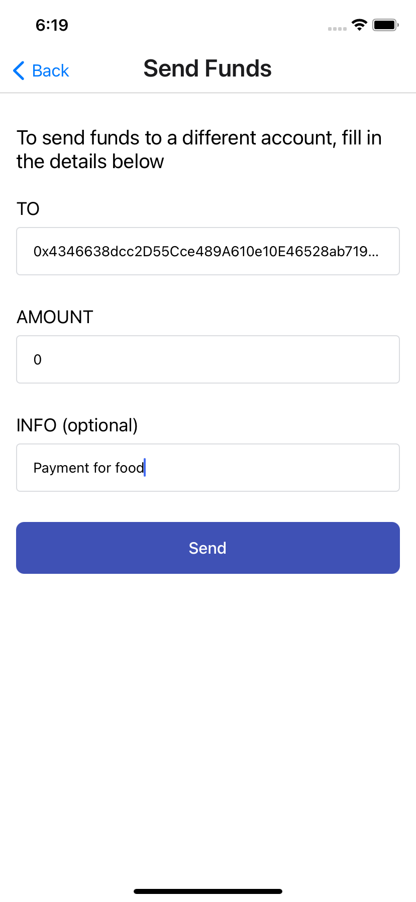
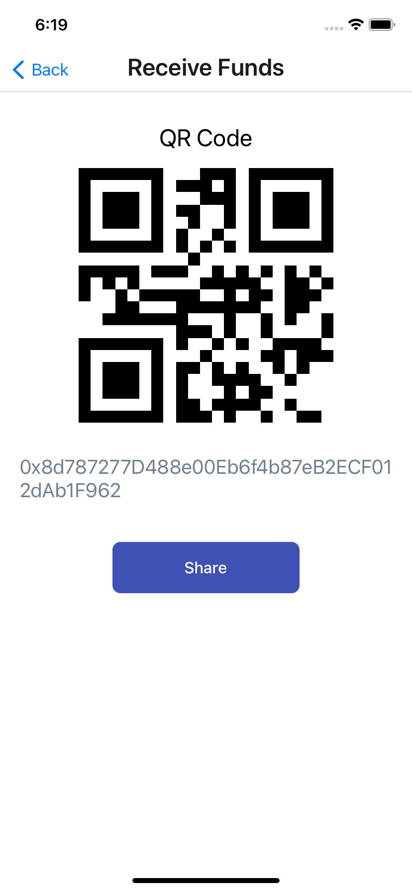

# Instadapp Trial Task

## Screenshots

### Onboarding

### Intro Screen, Create Wallet, Login

### Dashboard, Send Txn, Receive Txn

## Steps to run the app

1. Clone the app
2. Install Packages with `yarn install`
3. Rename `.env.should-be-renamed` to `.env`
4. Run the app with `yarn ios`

## Notes and further improvements

### Switch Expo Secure Store to KeyChain/KeyStore

The `user password`, `uniqueID`, `user account`, and `onboarding status` are all single key entries stored locally on the device with the use of Expo Secure Store, this is the same as AsyncStorage but it's not secure as it isn't encrypted. A better alternative would be to use
[React Native Keychain/Keystore](https://github.com/oblador/react-native-keychain)

### Switch Infura keys from .env to a more secure and encrypted option

Currently the private keys and secrets to Infura are all stored in a local .env file which is not secure at all since it is bundled with the rest of code in production. There are multiple ways to take of this, a better solution would have to be one that involves some kind of encryption and can't be exposed when reversed engineered. See
[Storing sensitive information in React Native](https://reactnative.dev/docs/security#storing-sensitive-info)

### Figure out a way to work with the secure pass phrase

The `import wallet` functionality is not implemented yet. This is because adding support for a secure passphrase in the same way MetaMask has it would require more time and effort to figure out the best way to:

- Generate the unique passphrase
- Properly store the passphrase
- Create a UX flow around inputting the passphrase
- Implement this closely with the `import wallet` functionality

### Add support for faceID and logout the user idle interval

Right now, there's no biometrics support. The current means of login in the app remains the use of the on-device password. Adding support for say Fingerprint or FaceID will improve the security of the app and doesn't require the user to always type in a password.

Also, with MetaMask, after a period of idle time while the app is running, your session is automatically terminated and the user is returned to the login screen to login into the app.

### Learn more about MetaMask security

There's a lot to learn and implement regarding security for an app like this. Using MetaMask as a case study exposes more room for improvement since it is popular and open-source. It is also built with React Native too.
[Here is a detailed case study on how MetaMask stores wallet secrets](https://www.wispwisp.com/index.php/2020/12/25/how-metamask-stores-your-wallet-secret/)
